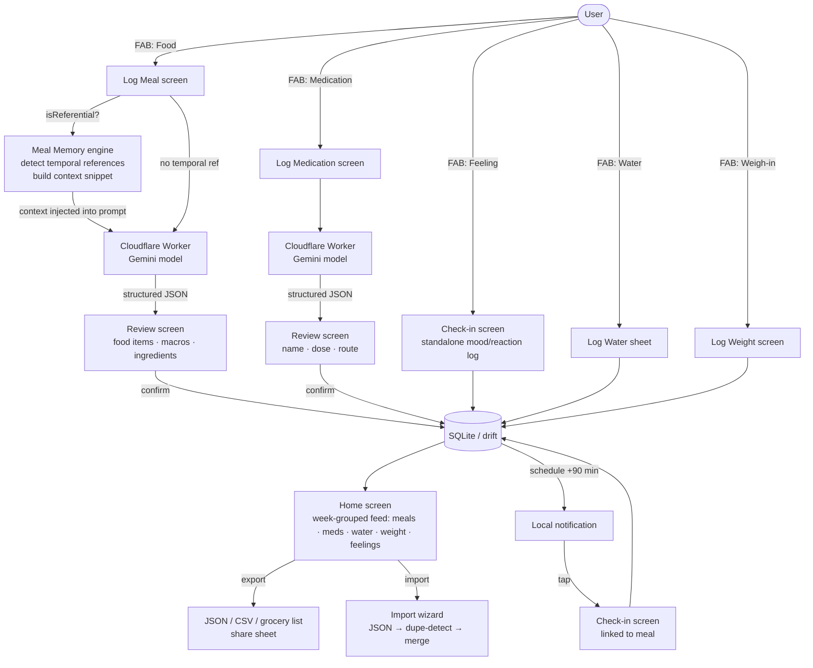

# Food Journal

Mobile-first journal for tracking meals, macros, ingredients, medications, water, weight, and GI/health reactions. An AI layer (Cloudflare Worker + Gemini) parses unstructured input — text descriptions, photos — into structured data. All data stays on-device (SQLite). No backend, no cloud sync - which is a feature, not an oversight.

## Features

### Logging

| Entry type | How it works |
| ---------- | ------------ |
| **Food / Meal** | Describe in free text and/or attach a photo. AI parses → pre-fills food items, portions, macros, ingredients. Review and confirm before saving. Multiple food items per meal. |
| **Medication** | Same text/photo flow. AI extracts name, dose, unit, route. Manual entry always available. |
| **Water** | Quick-entry sheet (no AI). Log amount in ml; daily total shown in feed. |
| **Weigh-in** | Log weight in lbs or kg with optional notes. Appears in the feed alongside other entries. |
| **Feeling** | Standalone reaction log — multi-select symptoms, severity, free-text notes — no meal required. Also triggered by check-in notifications. |

### Home feed

- Entries grouped by **week**, then by day — meals, medications, water, weight, and feelings in one chronological view
- **Weekly macro summary** — total calories, protein, carbs, fat for the week
- **Reaction badges** on food items flagged in food memory
- Expandable day sections; today highlighted

### AI & meal intelligence

- **AI parsing** — Cloudflare Worker + Gemini. Handles both meal and medication input. The app talks only to the Worker; the Gemini key lives server-side.
- **Meal memory engine** — detects temporal references ("leftovers from last night", "the usual") and injects relevant past-meal context into the prompt so AI can pre-fill without you repeating yourself
- **AI toggle** — disable AI in Settings; all entry screens fall back to manual form instantly

### Food history & saved items

- **Food history search** — search any food item logged in the past; one tap re-uses it in the current meal
- **Reuse nudge** — while typing a food or medication name, a debounced fuzzy-token match runs against recent history; a chip appears when a close match is found (`Reuse "Turkey Sandwich"`). One tap adopts the name + macros. No match → no chip → zero extra clicks. Fuzzy-token Jaccard (threshold 0.5, length-gated character-trigram fallback) catches compound variants (`hamburger` → `burger`) and wording variants, while blocking false merges (`turkey sandwich` / `tuna sandwich`)
- **Entity resolution** — every saved food/med gets a `canonical_name` (lowercase, whitespace/punctuation collapsed). Blame and future dashboards group on canonical identity so the same food logged with different phrasing accumulates in one bucket
- **Favorites** — star foods in history or food memory; filter history to favorites-only for quick re-use
- **Saved items** — create named food templates with macros (e.g., "My Protein Shake — 300 cal / 40g protein"); insert into any meal log with one tap

### Reaction tracking & food memory

- Push notification ~90 min after each meal/medication save (configurable delay)
- Check-in screen: multi-select symptoms, severity (none/mild/moderate/bad), notes
- **Blame ledger** — on every check-in with symptoms, every food/med logged in the prior 16h is auto-suspected; user can manually blame specific items from a 24h window. Suspicions accumulate per `(item, symptom)` across all logs with severity weighting — the basis for "what bloats me most" queries
- **Food memory** — automatically flags foods with 2+ non-none reactions; configurable lookback window (30 / 90 / 180 days / all time)
- Flagged foods show a warning badge anywhere they appear in the feed

### Export & import

- **CSV export** — full journal with `entry_type` column; shareable via OS share sheet
- **Grocery list export** — aggregates ingredients from selected date range, deduplicated and sorted
- **JSON import** — import wizard with duplicate detection and merge

## App flow



Standalone Feeling logs (`FAB → Feeling`) save a `ReactionLog` with no linked meal — they appear in the home feed as their own tile. AI can be toggled off in Settings; all entry screens fall back to manual form when disabled.

## Stack

| Layer | Technology | Notes |
| ------- | ----------- | ----- |
| UI | Flutter (Dart) | Android primary, iOS same codebase |
| AI | Cloudflare Worker + Gemini | `MEAL_PARSER_URL` in `.env`; handles `parse_meal` and `parse_medication` tasks; auto-retries once on 503 |
| Storage | drift (SQLite) | Local only; schema v12 is a stable contract |
| Settings | shared_preferences | AI toggle (`ai_enabled`); persists across launches |
| Notifications | flutter_local_notifications | Post-entry check-in, ~90 min configurable delay |
| Camera | image_picker | Camera primary, gallery fallback |
| Export/Import | share_plus | JSON + CSV + grocery list export; JSON import wizard with dupe detection |

## Architecture highlights

**AI-optional** — every AI-powered flow has a complete manual fallback. AI pre-fills; it never blocks. If the API is unavailable, the key is missing, or the user has toggled AI off in Settings — the manual entry form shows directly.

**Schema as contract** — the SQLite schema (v12) is a stable API. No column rename or removal without a drift migration and a corresponding integration test. AI-parsed JSON is validated before any DB write.

**Services as tool interface** — service methods are designed to be exposable as Claude tool-use functions (clear typed inputs/outputs, single responsibility). Forward-compatible for an agentic AI layer calling services as tools.

## Areas of interest

### AI service layer — `app/lib/services/`

- [`ai_service.dart`](app/lib/services/ai_service.dart) — the `AiService` interface; defines `MealParseResult` / `MedicationParseResult` types and the `AiService.fromEnv()` factory
- [`worker_ai_service.dart`](app/lib/services/worker_ai_service.dart) — sole implementation: Cloudflare Worker + Gemini; handles `mealContext` injection for temporal references; auto-retries once on 503

### Meal memory engine — `app/lib/services/meal_memory/`

Solves "I had the leftovers from last night" without a round-trip or a vector DB:

1. [`reference_engine.dart`](app/lib/services/meal_memory/reference_engine.dart) — rule runner; compiles regex patterns once at startup; confidence scoring (first match = 1.0, each additional match on same rule = +0.5); in-process cache
2. [`meal_reference_rules.dart`](app/lib/services/meal_memory/meal_reference_rules.dart) — domain rules: temporal references (`yesterday`, `last night`, `leftovers`, `the usual`, …) and meal-type hints
3. [`meal_memory_service.dart`](app/lib/services/meal_memory/meal_memory_service.dart) — `isReferential()` (O(µs), no DB), `buildContextSnippet()` (≤200 tokens injected into prompt), `findReferentialMeals()` (AI-off quick-copy fallback), `recordFingerprint()` (rolling 40-row window)

The Python reference implementation lives in [`docs/meal_memory_starter/`](docs/meal_memory_starter/) — pattern engine, domain rules, and agent brief explaining the design decisions.

### Food history, saved items & reuse nudge — `app/lib/widgets/`

- [`food_history_search_sheet.dart`](app/lib/widgets/food_history_search_sheet.dart) — full-text search over every food item ever logged; togglable favorites-only filter; selecting pre-fills a new food item row with all prior macros
- [`saved_items_sheet.dart`](app/lib/widgets/saved_items_sheet.dart) — manage and insert named food templates with stored macros
- [`create_saved_item_sheet.dart`](app/lib/widgets/create_saved_item_sheet.dart) — create/edit a saved item template
- [`editable_food_item_card.dart`](app/lib/widgets/editable_food_item_card.dart) — food item card with inline reuse nudge (debounced fuzzy lookup → chip on match)
- [`reuse_suggestion.dart`](app/lib/widgets/reuse_suggestion.dart) — `ReuseSuggestionChip`: adopt tap + dismiss ×

Favorites on `FoodMemories.favorited`; saved items in `SavedItems`; entity keys on `food_items.canonical_name` / `medications.canonical_name`.

### Entity resolution — `app/lib/models/food_entity.dart`

Pure, offline, no AI. Two exports:

- `canonicalize(name)` — lowercase → strip punct → collapse whitespace. The single normalization written to `canonical_name` at save and used by the matcher.
- `bestNameMatch(typed, candidates)` — fuzzy-token Jaccard (threshold 0.5). Finds the best history candidate. Powers the reuse nudge chip.

### Blame ledger — `app/lib/models/food_suspicion.dart`

Pure functions (testable without native sqlite):

- `buildSuspicionRows()` — fan-out: one row per `(symptom × candidate)`, auto + manual sources
- `aggregateSuspicions()` — sum effective weight by `(targetName, symptom)`
- `isWithinBlameWindow()` / `suspicionWeightFor()` / `effectiveSuspicionWeight()`

SQL path in `StorageService.applyBlame()` + `getSuspicionScores()`.

### Test suite — `app/test/`

Three tiers:

| Tier | Location | What it covers |
| ------ | ---------- | --------------- |
| Deterministic unit | [`test/models/`](app/test/models/), [`test/meal_memory/`](app/test/meal_memory/), [`test/services/`](app/test/services/) | Pure logic: entity resolution, blame ledger, meal memory — 200+ tests, no network |
| Widget | [`test/widgets/`](app/test/widgets/) | UI component rendering and interaction (~420 total with all tiers) |
| Live AI integration | [`test/integration/ai/`](app/test/integration/ai/) | Real API calls; structural + semantic contracts on parse output; requires `.env` |

Testing data flow (LLM-judge pipeline for validating AI output quality): [`docs/testing_data_flow.md`](docs/testing_data_flow.md)

### Feature and architecture docs — `docs/`

| Doc | Contents |
| ----- | ---------- |
| [`ARCHITECTURE.md`](docs/ARCHITECTURE.md) | Design principles, full data flow diagram, DB schema, AI service flow |
| [`FEATURES.md`](docs/FEATURES.md) | Complete feature spec (F1–F10) + stretch goals + explicit non-goals |
| [`STACK.md`](docs/STACK.md) | Flutter patterns (state management, service injection, async UI), package list |

## Project structure

```text
app/
├── lib/
│   ├── main.dart
│   ├── models/
│   │   ├── food_entity.dart          # canonicalize(), bestNameMatch(), fuzzy-token Jaccard
│   │   ├── food_suspicion.dart       # blame ledger types + pure logic (buildSuspicionRows etc.)
│   │   ├── food_item.dart            # FoodItem, FoodItemDraft, ReactionLevel
│   │   ├── food_memory.dart
│   │   ├── meal_entry.dart
│   │   ├── medication.dart
│   │   ├── reaction_log.dart
│   │   └── ...
│   ├── services/
│   │   ├── ai_service.dart           # AiService interface + result types + factory
│   │   ├── worker_ai_service.dart    # Cloudflare Worker / Gemini impl (sole)
│   │   ├── storage_service.dart      # drift DB abstraction (schema v12)
│   │   ├── notification_service.dart
│   │   ├── export_service.dart       # CSV + grocery list
│   │   ├── import_service.dart       # JSON import (dupe-detect + merge)
│   │   ├── settings_service.dart
│   │   ├── seed_service.dart         # dev seed data
│   │   ├── database/                 # drift schema (v12) + generated code
│   │   └── meal_memory/              # pattern engine + context injection
│   ├── screens/
│   │   ├── home/                     # journal feed, week-grouped nav
│   │   ├── log_meal/                 # text + photo input, saved-items picker, history search
│   │   ├── log_medication/           # medication entry
│   │   ├── log_water/                # quick water log sheet
│   │   ├── log_weight/               # weigh-in entry
│   │   ├── meal_detail/              # view/edit single meal
│   │   ├── checkin/                  # reaction check-in + blame modal
│   │   ├── export/                   # export options
│   │   └── import/                   # import wizard
│   ├── utils/
│   └── widgets/
│       ├── editable_food_item_card.dart  # meal item card with inline reuse nudge
│       ├── reuse_suggestion.dart         # ReuseSuggestionChip (Layer B nudge)
│       ├── blame_sheet.dart             # blame modal (food_blame)
│       ├── food_history_search_sheet.dart
│       ├── saved_items_sheet.dart
│       └── ...
├── test/
│   ├── models/                       # pure-logic unit tests (entity resolution, blame)
│   ├── meal_memory/                  # deterministic rule + engine tests
│   ├── integration/ai/               # live API integration tests
│   ├── widgets/                      # widget tests
│   └── services/
├── android/
└── ios/
docs/
├── ARCHITECTURE.md
├── FEATURES.md
├── STACK.md
├── testing_data_flow.md
└── meal_memory_starter/              # Python reference impl + agent brief
```

## Prerequisites

- Flutter SDK (Dart 3.9.x)
- Android Studio + Android SDK (emulator or USB device)
- Access to the Cloudflare Worker endpoint

## Environment files

Two separate `.env` files. Both gitignored. See the `.env.example` at each level for the full key list.

### `app/.env` — bundled into the app binary

`flutter_dotenv` loads this as a Flutter asset — it is **included verbatim in the compiled APK/IPA and readable by anyone who decompiles the app**. Only non-secret config belongs here.

```env
MEAL_PARSER_URL=https://your-worker.workers.dev
CHECKIN_DELAY_MINUTES=90
```

The Worker holds its own Gemini key server-side. The app only needs the endpoint URL.

### `.env` (repo root) — developer machine only, never bundled

Used by integration tests via `test_env.dart` (`Platform.environment` first, then this file as fallback). Never touches the app binary.

```env
MEAL_PARSER_URL=https://...       # Worker endpoint — integration tests POST here
TEST_AUTH_TOKEN=...               # Worker auth in tests
GEMINI_API_KEY_PAID=...           # Worker backend (server-side)
CLOUDFLARE_API_TOKEN=...          # Worker deployment
```

## Setup

1. Clone the repo
2. `cp app/.env.example app/.env` — fill in `MEAL_PARSER_URL`
3. `cp .env.example .env` — fill in secrets (only needed for integration tests)
4. Run `start.bat` from repo root

## Dev workflow

```bat
start.bat   # pub get → drift codegen → flutter run
stop.bat    # kill dart/flutter processes
```

**In a running Flutter session:** `r` hot reload · `R` hot restart · `q` quit

**Physical Android device:** Enable Developer Options → USB Debugging → plug in → `start.bat` auto-detects.

**Tests (no network required):**

```bat
cd app && flutter test test/meal_memory test/widgets test/models
```

**Live AI integration tests** (requires `.env` with valid keys):

```bat
cd app && flutter test test/integration/ai
```
