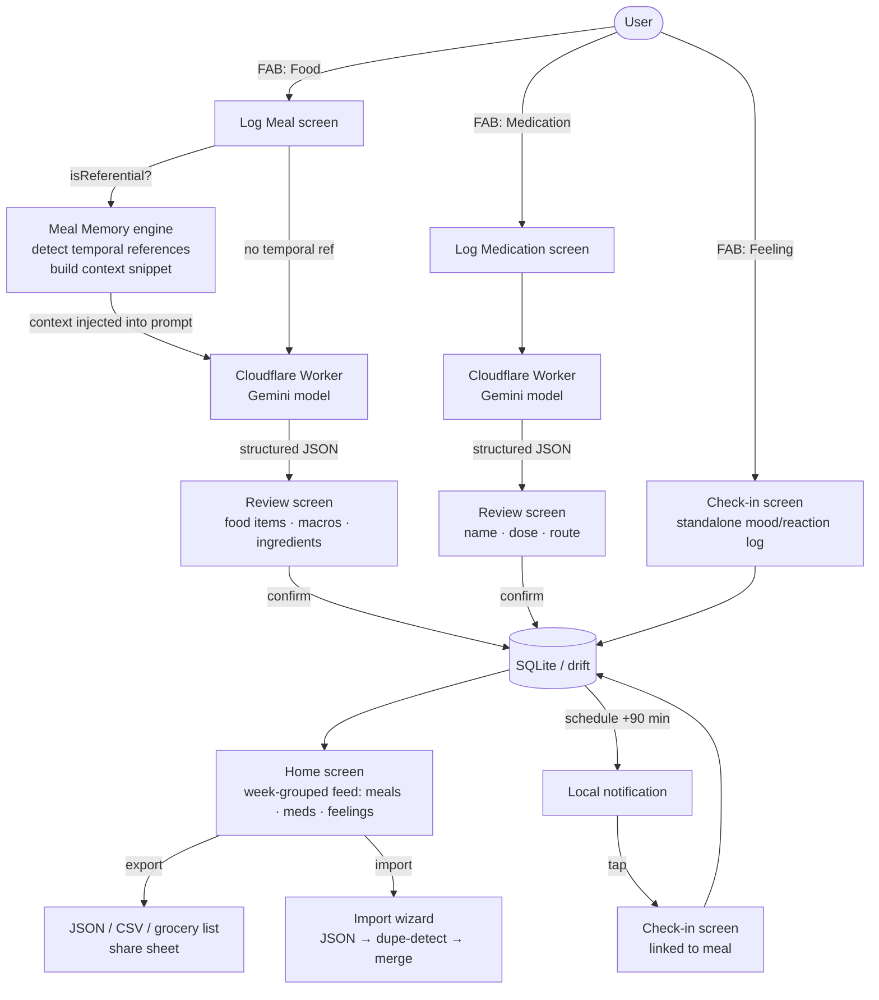

# Food Journal

Mobile-first journal for tracking meals, macros, ingredients, medications, and GI/health reactions. An AI layer (Cloudflare Worker + Gemini) parses unstructured input — text descriptions, photos — into structured data. All data stays on-device (SQLite). No backend, no cloud sync.

## App flow



Standalone Feeling logs (`FAB → Feeling`) save a `ReactionLog` with no linked meal — they appear in the home feed as their own tile. AI can be toggled off in Settings; both log screens fall back to manual entry form when disabled.

## Stack

| Layer | Technology | Notes |
| ------- | ----------- | ----- |
| UI | Flutter (Dart) | Android primary, iOS same codebase |
| AI — primary | Cloudflare Worker + Gemini | `MEAL_PARSER_URL` in `.env`; handles `parse_meal` and `parse_medication` tasks |
| AI — fallback | Claude API (`claude-sonnet-4-6`) | Direct REST; `ANTHROPIC_API_KEY` in root `.env` (not `app/.env`); integration tests only |
| Storage | drift (SQLite) | Local only; schema v4 is a stable contract |
| Settings | shared_preferences | AI toggle (`ai_enabled`); persists across launches |
| Notifications | flutter_local_notifications | Post-entry check-in, ~90 min configurable delay |
| Camera | image_picker | Camera primary, gallery fallback |
| Export/Import | share_plus | JSON + CSV + grocery list export; JSON import wizard with dupe detection |

## Architecture highlights

**AI-optional** — every AI-powered flow has a complete manual fallback. AI pre-fills; it never blocks. If the API is unavailable, the key is missing, or the user has toggled AI off in Settings — the manual entry form shows directly.

**Schema as contract** — the SQLite schema (v4) is a stable API. No column rename or removal without a drift migration and a corresponding integration test. AI-parsed JSON is validated before any DB write.

**Services as tool interface** — service methods are designed to be exposable as Claude tool-use functions (clear typed inputs/outputs, single responsibility). Forward-compatible for an agentic AI layer calling services as tools.

## Areas of interest

### AI service layer — `app/lib/services/`

Two implementations behind a common `AiService` interface:

- [`ai_service.dart`](app/lib/services/ai_service.dart) — direct Claude API (`claude-sonnet-4-6`); defines `MealParseResult` and `MedicationParseResult` types
- [`worker_ai_service.dart`](app/lib/services/worker_ai_service.dart) — Cloudflare Worker + Gemini; primary production path; handles `mealContext` injection for temporal references; auto-retries on 503

### Meal memory engine — `app/lib/services/meal_memory/`

Solves "I had the leftovers from last night" without a round-trip or a vector DB:

1. [`reference_engine.dart`](app/lib/services/meal_memory/reference_engine.dart) — rule runner; compiles regex patterns once at startup; confidence scoring (first match = 1.0, each additional match on same rule = +0.5); in-process cache
2. [`meal_reference_rules.dart`](app/lib/services/meal_memory/meal_reference_rules.dart) — domain rules: temporal references (`yesterday`, `last night`, `leftovers`, `the usual`, …) and meal-type hints
3. [`meal_memory_service.dart`](app/lib/services/meal_memory/meal_memory_service.dart) — `isReferential()` (O(µs), no DB), `buildContextSnippet()` (≤200 tokens injected into prompt), `findReferentialMeals()` (AI-off quick-copy fallback), `recordFingerprint()` (rolling 40-row window)

The Python reference implementation lives in [`docs/meal_memory_starter/`](docs/meal_memory_starter/) — pattern engine, domain rules, and agent brief explaining the design decisions.

### Test suite — `app/test/`

Three tiers:

| Tier | Location | What it covers |
| ------ | ---------- | --------------- |
| Deterministic unit | [`test/meal_memory/`](app/test/meal_memory/) | Temporal logic, invariance, directional scoring, macro drift — ~145 tests, no network |
| Widget | [`test/widgets/`](app/test/widgets/) | UI component rendering and interaction |
| Live AI integration | [`test/integration/ai/`](app/test/integration/ai/) | Real API calls; structural + semantic contracts on parse output; requires `.env` |

Testing data flow (LLM-judge pipeline for validating AI output quality): [`docs/testing_data_flow.md`](docs/testing_data_flow.md)

### Feature and architecture docs — `docs/`

| Doc | Contents |
| ----- | ---------- |
| [`ARCHITECTURE.md`](docs/ARCHITECTURE.md) | Design principles, full data flow diagram, DB schema, AI service flow |
| [`FEATURES.md`](docs/FEATURES.md) | Complete feature spec (F1–F10) + stretch goals + explicit non-goals |
| [`STACK.md`](docs/STACK.md) | Flutter patterns (state management, service injection, async UI), package list |

## Project structure

```text
app/
├── lib/
│   ├── main.dart
│   ├── models/                       # Dart data classes
│   ├── services/
│   │   ├── ai_service.dart           # AiService interface + Claude direct impl
│   │   ├── worker_ai_service.dart    # Cloudflare Worker / Gemini impl
│   │   ├── storage_service.dart      # drift DB abstraction
│   │   ├── notification_service.dart
│   │   ├── export_service.dart       # CSV + grocery list
│   │   ├── import_service.dart       # CSV import
│   │   ├── settings_service.dart
│   │   ├── seed_service.dart         # dev seed data
│   │   ├── database/                 # drift schema + generated code
│   │   └── meal_memory/              # pattern engine + context injection
│   ├── screens/
│   │   ├── home/                     # journal feed, day/week nav
│   │   ├── log_meal/                 # text + photo input
│   │   ├── log_medication/           # medication entry
│   │   ├── meal_detail/              # view/edit single meal
│   │   ├── checkin/                  # reaction check-in
│   │   ├── export/                   # export options
│   │   └── import/                   # import wizard
│   ├── utils/
│   └── widgets/                      # shared UI components
├── test/
│   ├── meal_memory/                  # deterministic rule + engine tests
│   ├── integration/ai/               # live API integration tests
│   ├── widgets/                      # widget tests
│   └── services/
├── android/
└── ios/
docs/
├── ARCHITECTURE.md
├── FEATURES.md
├── STACK.md
├── testing_data_flow.md
└── meal_memory_starter/              # Python reference impl + agent brief
```

## Prerequisites

- Flutter SDK (Dart 3.9.x)
- Android Studio + Android SDK (emulator or USB device)
- Access to the Cloudflare Worker endpoint

## Environment files

Two separate `.env` files. Both gitignored. See the `.env.example` at each level for the full key list.

### `app/.env` — bundled into the app binary

`flutter_dotenv` loads this as a Flutter asset — it is **included verbatim in the compiled APK/IPA and readable by anyone who decompiles the app**. Only non-secret config belongs here.

```env
MEAL_PARSER_URL=https://your-worker.workers.dev
CHECKIN_DELAY_MINUTES=90
```

The Worker holds its own Gemini key server-side. The app only needs the endpoint URL.

### `.env` (repo root) — developer machine only, never bundled

Used by integration tests via `test_env.dart` (`Platform.environment` first, then this file as fallback). Never touches the app binary.

```env
ANTHROPIC_API_KEY=sk-ant-...      # integration tests only — never put this in app/.env
MEAL_PARSER_URL=https://...       # duplicated for test scripts
GEMINI_API_KEY_PAID=...           # Worker backend (server-side)
CLOUDFLARE_API_TOKEN=...          # Worker deployment
TEST_AUTH_TOKEN=...               # Worker auth in tests
```

## Setup

1. Clone the repo
2. `cp app/.env.example app/.env` — fill in `MEAL_PARSER_URL`
3. `cp .env.example .env` — fill in secrets (only needed for integration tests)
4. Run `start.bat` from repo root

## Dev workflow

```bat
start.bat   # pub get → drift codegen → flutter run
stop.bat    # kill dart/flutter processes
```

**In a running Flutter session:** `r` hot reload · `R` hot restart · `q` quit

**Physical Android device:** Enable Developer Options → USB Debugging → plug in → `start.bat` auto-detects.

**Tests (no network required):**

```bat
cd app && flutter test test/meal_memory test/widgets test/models
```

**Live AI integration tests** (requires `.env` with valid keys):

```bat
cd app && flutter test test/integration/ai
```
