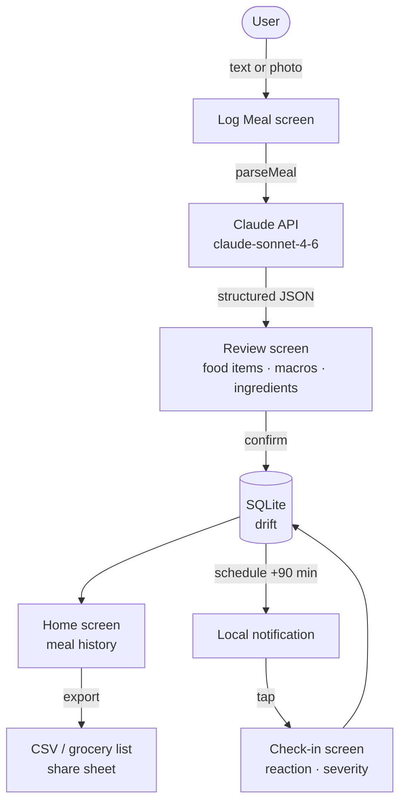

# Food Journal

Mobile app for tracking meals, macros, ingredients, and GI/health reactions. AI parses unstructured meal descriptions (text + photos) into structured data. All data stays on-device.

## Flow



## Stack

- **Flutter** — Android primary, iOS secondary
- **Claude API** (`claude-sonnet-4-6`) — meal parsing via text + image input
- **drift** (SQLite) — local-only storage
- **flutter_local_notifications** — post-meal check-in reminders (~90 min after eating)

## Prerequisites

- Flutter SDK (Dart 3.9.x)
- Android Studio + Android SDK (for emulator or USB device debugging)
- Anthropic API key

## Setup

1. Clone the repo
2. Create `app/.env`:

   ```env
   ANTHROPIC_API_KEY=sk-ant-...
   CHECKIN_DELAY_MINUTES=90
   ```

3. Run `start.bat` from the repo root

## Dev workflow

```bat
start.bat   # pub get → drift codegen → flutter run
stop.bat    # kill dart/flutter processes (run from second terminal if needed)
```

**In a running Flutter session:** `r` hot reload · `R` hot restart · `q` quit

**Testing on physical Android device:** Enable Developer Options → USB Debugging → plug in via USB → `start.bat` auto-detects.

## Project structure

```text
app/
├── lib/
│   ├── models/         # Dart data classes
│   ├── services/       # AI, storage, notifications, export
│   ├── screens/        # home, log_meal, meal_detail, checkin, export
│   └── widgets/        # shared UI components
├── android/
└── ios/
docs/
├── ARCHITECTURE.md
├── FEATURES.md
└── STACK.md
```
