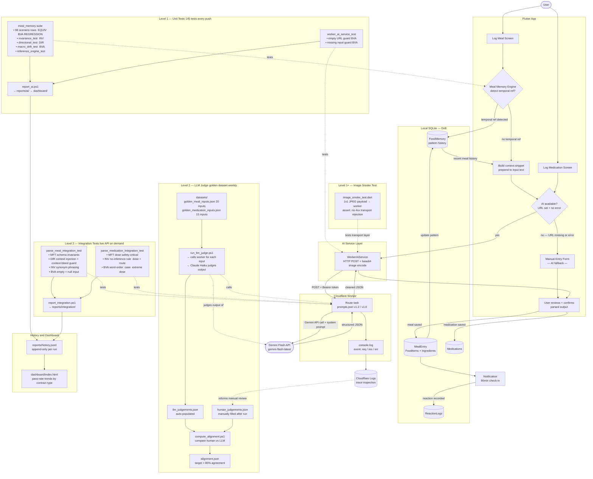

```mermaid
flowchart TD
    U(["User"])

    subgraph APP["Flutter App"]
        LS["Log Meal Screen"]
        LMD["Log Medication Screen"]
        MME{"Meal Memory Engine\ndetect temporal ref?"}
        CTX["Build context snippet\nprepend to input text"]
        AVAIL{"AI available?\nURL set + no error"}
        MAN["Manual Entry Form\n— AI fallback —"]
        CONF["User reviews + confirms\nparsed output"]
    end

    subgraph AISVC["AI Service Layer"]
        WAS["WorkerAiService\nHTTP POST + base64 image encode"]
    end

    subgraph CF["Cloudflare Worker"]
        WRK["Route task\nprompts.json v1.2 / v1.0"]
        WLOG["console.log\nevent: req / res / err"]
    end

    GEMINI(["Gemini Flash API\ngemini-flash-latest"])
    CFLOGS[("Cloudflare Logs\ntrace inspection")]

    subgraph DB["Local SQLite — Drift"]
        MEALDB[("MealEntry\nFoodItems + Ingredients")]
        MEDDB[("Medications")]
        FMDB[("FoodMemory\npattern history")]
        RLDB[("ReactionLogs")]
    end

    NOTIF["Notification\n90min check-in"]

    %% User flow
    U --> LS
    U --> LMD
    LS --> MME
    MME -- "temporal ref detected" --> FMDB
    FMDB -- "recent meal history" --> CTX
    MME -- "no temporal ref" --> CTX
    CTX --> AVAIL
    LMD --> AVAIL

    AVAIL -- "yes" --> WAS
    AVAIL -- "no — URL missing or error" --> MAN
    MAN --> CONF

    WAS -- "POST + Bearer token" --> WRK
    WRK --> WLOG --> CFLOGS
    WRK -- "Gemini API call + system prompt" --> GEMINI
    GEMINI -- "structured JSON" --> WRK
    WRK -- "cleaned JSON" --> WAS
    WAS --> CONF

    CONF -- "meal saved" --> MEALDB
    CONF -- "medication saved" --> MEDDB
    MEALDB -- "update pattern" --> FMDB
    MEALDB --> NOTIF
    NOTIF -- "reaction recorded" --> RLDB

    %% ── Testing Systems ──────────────────────────────────────────────────────

    subgraph T1["Level 1 — Unit Tests   145 tests   every push"]
        direction LR
        T1A["meal_memory suite\n• 98 scenario rows  EQUIV BVA REGRESSION\n• invariance_test  INV\n• directional_test  DIR\n• macro_drift_test  BVA\n• reference_engine_test"]
        T1B["worker_ai_service_test\n• empty URL guard  BVA\n• missing input guard  BVA"]
        T1R["report_ai.ps1\n→ reports/ai/  →  dashboard/"]
        T1A --> T1R
        T1B --> T1R
    end

    subgraph T15["Level 1+ — Image Smoke Test"]
        T15A["image_smoke_test.dart\n1x1 JPEG payload → worker\nassert: no 4xx transport rejection"]
    end

    subgraph T2["Level 2 — Integration Tests   live API   on demand"]
        direction LR
        T2A["parse_meal_integration_test\n• MFT schema invariants\n• DIR context injection + context-bleed guard\n• INV synonym phrasing\n• BVA empty + null input"]
        T2B["parse_medication_integration_test\n• MFT dose safety-critical\n• INV no-inference rule  dose + route\n• BVA word-order  case  extreme dose"]
        T2R["report_integration.ps1\n→ reports/integration/"]
        T2A --> T2R
        T2B --> T2R
    end

    subgraph T3["Level 2 — LLM Judge   golden dataset   weekly"]
        direction LR
        T3G["datasets/\ngolden_meal_inputs.json 20 inputs\ngolden_medication_inputs.json 15 inputs"]
        T3RJ["run_llm_judge.ps1\n→ calls worker for each input\n→ Claude Haiku judges output"]
        T3LJ["llm_judgements.json\nauto-populated"]
        T3HJ["human_judgements.json\nmanually filled after run"]
        T3CA["compute_alignment.ps1\ncompare human vs LLM"]
        T3AL["alignment.json\ntarget > 85% agreement"]
        T3G --> T3RJ
        T3RJ --> T3LJ
        T3LJ --> T3CA
        T3HJ --> T3CA
        T3CA --> T3AL
    end

    subgraph HIST["History and Dashboard"]
        direction LR
        HJSONL["reports/history.jsonl\nappend-only per run"]
        DASH["dashboard/index.html\npass-rate trends by contract type"]
        HJSONL --> DASH
    end

    %% Test → production linkages
    T1A -. "tests" .-> MME
    T1B -. "tests" .-> WAS
    T15A -. "tests transport layer" .-> WAS
    T2A -. "tests" .-> WRK
    T2B -. "tests" .-> WRK
    T3RJ -. "calls" .-> WRK
    T3RJ -. "judges output of" .-> GEMINI
    CFLOGS -. "informs manual review" .-> T3HJ

    %% Reporting feeds into history
    T1R --> HJSONL
    T2R --> HJSONL
```