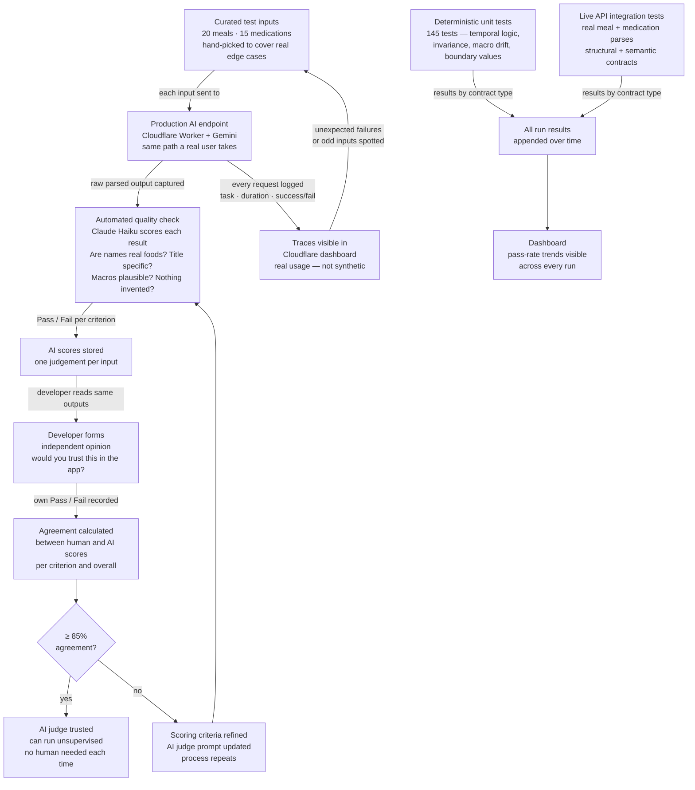

# Food Journal — Testing Layer Data Flow

```mermaid
flowchart TD

    %% ── Golden dataset ───────────────────────────────────────────────────────

    GD["Curated test inputs\n20 meals · 15 medications\nhand-picked to cover real edge cases"]

    GD -- "each input sent to" --> WORKER["Production AI endpoint\nCloudflare Worker + Gemini\nsame path a real user takes"]

    WORKER -- "raw parsed output captured" --> JUDGE["Automated quality check\nClaude Haiku scores each result\nAre names real foods? Title specific?\nMacros plausible? Nothing invented?"]

    JUDGE -- "Pass / Fail per criterion" --> LLMOUT["AI scores stored\none judgement per input"]

    %% ── Human review ─────────────────────────────────────────────────────────

    LLMOUT -- "developer reads same outputs" --> HUMAN["Developer forms\nindependent opinion\nwould you trust this in the app?"]

    HUMAN -- "own Pass / Fail recorded" --> COMPARE["Agreement calculated\nbetween human and AI scores\nper criterion and overall"]

    %% ── Alignment decision ───────────────────────────────────────────────────

    COMPARE --> CHECK{"≥ 85%\nagreement?"}
    CHECK -- "yes" --> TRUSTED["AI judge trusted\ncan run unsupervised\nno human needed each time"]
    CHECK -- "no" --> TUNE["Scoring criteria refined\nAI judge prompt updated\nprocess repeats"]
    TUNE --> JUDGE

    %% ── Worker trace logs ────────────────────────────────────────────────────

    WORKER -- "every request logged\ntask · duration · success/fail" --> TRACES["Traces visible in\nCloudflare dashboard\nreal usage — not synthetic"]
    TRACES -- "unexpected failures\nor odd inputs spotted" --> GD

    %% ── Deterministic + live test suites ─────────────────────────────────────

    UNIT["Deterministic unit tests\n145 tests — temporal logic,\ninvariance, macro drift, boundary values"]
    LIVE["Live API integration tests\nreal meal + medication parses\nstructural + semantic contracts"]

    UNIT -- "results by contract type" --> HISTORY
    LIVE -- "results by contract type" --> HISTORY

    HISTORY["All run results\nappended over time"]
    HISTORY --> DASH["Dashboard\npass-rate trends visible\nacross every run"]
```
