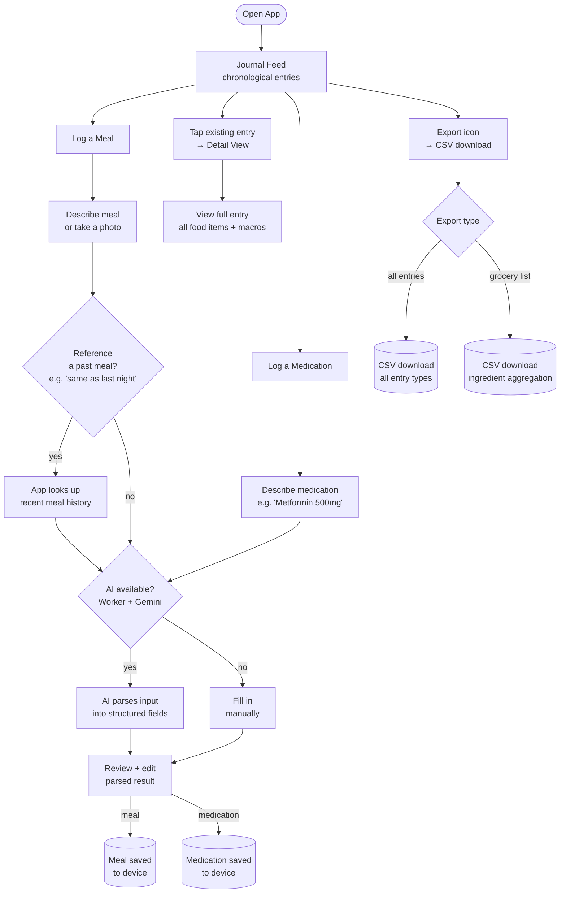

# Food Journal — User Journey

```mermaid
flowchart TD
    START(["Open App"])

    START --> HOME["Journal Feed\n— chronological entries —"]

    HOME --> ML["Log a Meal"]
    HOME --> MED["Log a Medication"]
    HOME --> ENTRY["Tap existing entry\n→ Detail View"]
    HOME --> EXPORT["Export icon\n→ CSV download"]

    %% ── Meal input ───────────────────────────────────────────────────────────

    ML --> INPUT["Describe meal\nor take a photo"]
    INPUT --> REF{"Reference\na past meal?\ne.g. 'same as last night'"}
    REF -- "yes" --> HIST["App looks up\nrecent meal history"]
    HIST --> AI
    REF -- "no" --> AI

    %% ── Medication input ─────────────────────────────────────────────────────

    MED --> MEDINPUT["Describe medication\ne.g. 'Metformin 500mg'"]
    MEDINPUT --> AI

    %% ── Shared AI endpoint ───────────────────────────────────────────────────

    AI{"AI available?\nWorker + Gemini"}
    AI -- "yes" --> PARSE["AI parses input\ninto structured fields"]
    AI -- "no" --> MANUAL["Fill in\nmanually"]

    PARSE --> REVIEW["Review + edit\nparsed result"]
    MANUAL --> REVIEW

    %% ── Save branches ────────────────────────────────────────────────────────

    REVIEW -- "meal" --> SAVE_MEAL[("Meal saved\nto device")]
    REVIEW -- "medication" --> SAVE_MED[("Medication saved\nto device")]


    %% ── Viewing entries ──────────────────────────────────────────────────────

    ENTRY --> DETAIL["View full entry\nall food items + macros"]

    %% ── Export ───────────────────────────────────────────────────────────────

    EXPORT --> EXPORTTYPE{"Export type"}
    EXPORTTYPE -- "all entries" --> CSV[("CSV download\nall entry types")]
    EXPORTTYPE -- "grocery list" --> GROCERY[("CSV download\ningredient aggregation")]
```
